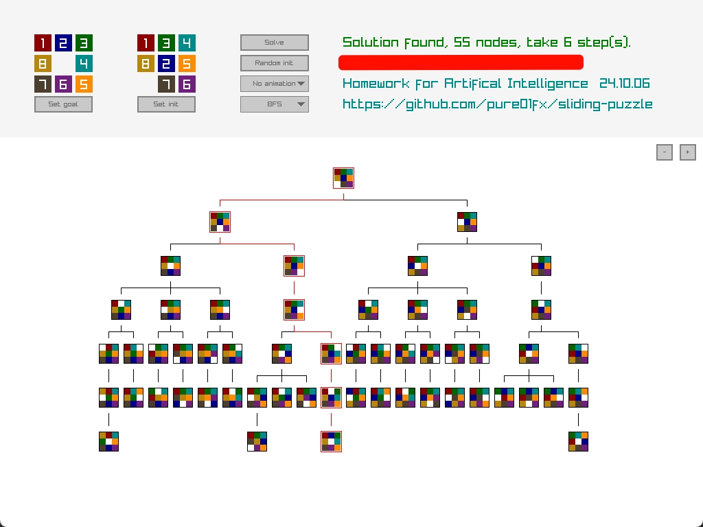

# 基于 A* 算法的九宫格问题求解与可视化

## 九宫格问题
九宫格问题，又称为滑块拼图，是一种经典的智力游戏。在这个问题中，我们有一个3x3的棋盘，上面有1至8的数字和一块空格。数字和空格的初始排列是随机的，目标是将数字滑动到目标状态，即从1到8按顺序排列，空格位于右下角。玩家只能移动一个空格旁边的数字到空格上。

## 求解方法

### BFS（广度优先搜索）
BFS 是一种遍历搜索算法，它从一个节点开始，探索所有相邻的节点，然后再探索那些节点的相邻节点，以此类推。在九宫格问题中，BFS可以用来找到从初始状态到目标状态的最短路径。BFS 在九宫格问题中的作用是尝试所有可能的移动，直到找到解决方案。BFS 的伪代码如下：

```
function BFS(initialState)
    create an empty queue Q
    enqueue the initial state to Q

    while Q is not empty do
        currentState = dequeue(Q)

        if isGoal(currentState) then
            return reconstructPath(currentState)

        for each move from currentState do
            nextState = move(currentState)
            if nextState is not in the frontier and not in the explored set then
                enqueue nextState to Q
                add nextState to the frontier

    return failure
```

### A算法介绍
A 算法是一种启发式搜索算法，它使用启发式函数来估算从当前节点到目标节点的距离。A算法的基本思想是，通过评估每个节点的启发式值，优先探索那些看起来更接近目标的节点。A 算法的关键在于它的启发式函数 $h(n)$，它提供了从节点 $n$ 到目标节点的估计成本。需要注意的是，A 算法并不保证得到的解是最优的。

### A*搜索算法
A\* 是对 A 算法的改进，它将 A 算法的启发式函数 $h(n)$ 约束为一致的（或称为单调的），意味着它永远不会高估实际成本。如果 $h(n)$ 满足一致性条件，A 算法就可以保证找到最优解，此时将此算法称为 A\* 算法。当 $h(x)$ 时，A*算法退化为 BFS 算法，适用于非启发式搜索。 A\* 算法的伪代码如下：

```
function A_Star(initialState)
    create an empty open set
    create an empty closed set
    add initialState to the open set

    while open set is not empty do
        currentState = get node in open set with the lowest f value (f = g + h)

        if currentState is the goal then
            return reconstructPath(currentState)

        remove currentState from open set
        add currentState to closed set

        for each neighbor of currentState do
            if neighbor is in closed set then
                continue
            temp_gScore = gScore(currentState) + distance(currentState, neighbor)
            if neighbor is not in open set or temp_gScore < gScore(neighbor) then
                if neighbor is not in open set then
                    add neighbor to open set
                set gScore(neighbor) to temp_gScore
                set parent(neighbor) to currentState
                set fScore(neighbor) to temp_gScore + h(neighbor)

    return failure
```

## 实验过程

### 启发函数的设置
`src/logic/bfs.rs`, `src/logic/a_star.rs`

```rust
impl Heuristic for BfsHeuristic {
    fn estimate_h(&mut self, _: &Puzzle, _: &Puzzle) -> i32 {
        0  // BFS 即 h(x)=0 的 A* 算法
    }
}

impl Heuristic for AStarHeuristic1 {
    fn estimate_h(&mut self, current: &Puzzle, goal: &Puzzle) -> i32 {
        let mut count = 0;

        for i in 0..3 { for j in 0..3 {
            if current.get_value(i, j) != goal.get_value(i, j) {
                count += 1;  // 计算当前状态和目标状态的相同格子数（包括空格）
            }
        }}

        count
    }
}

impl Heuristic for AStarHeuristic2 {
    fn estimate_h(&mut self, current: &Puzzle, goal: &Puzzle) -> i32 {
        let mut count = 0;

        for i in 0..3 { for j in 0..3 {
            if current.get_value(i, j) != goal.get_value(i, j) && current.get_value(i, j) != 0 {
                count += 1;  // 计算当前状态和目标状态的相同格子数（不包括空格）
            }
        }}

        count
    }
}
```

### 启发式搜索的实现
`src/logic/mod.rs :: solve_from_initial`

## 实验结果

### 求解过程的绘制



### 不同求解方法的比较

对于一个随机问题，不同方法最后得到的 closed set 的节点数量如下：

* BFS: 167964
* A* (1): 35150
* A* (2): 29070

可以发现，在有解的情况下，启发式搜索对于求解过程的效率提升是巨大的。

通过多次实验，发现三种方法求解得到的方法步数均保持相同，且第二种 A\* 算法在较多情况下会优于第一种方法 5% ~ 20%，但有时也会劣于第一种方法（如 `352;780;416` -> `123;804;765`）

## 实验结论

通过实验，可以发现如 A\* 等启发式方法对于九宫格问题的求解是有效的，通过合适的启发式函数，它能够显著减少搜索空间，并确保找到最
优解，且设计良好的启发式函数对其有较大的提升。
